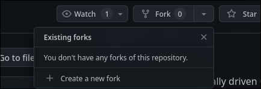
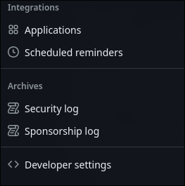
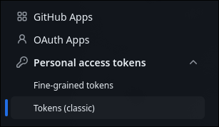
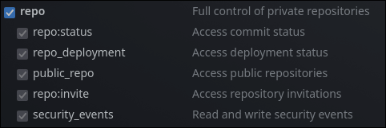
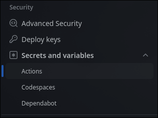
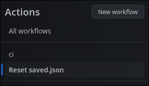

## 🤨 What is it?

GitForest is a dynamic, visually driven GitHub profile enhancement that
turns your contribution history into a forest. The more you code, the
bigger the forest grows. The forest will be periodically reset to prevent
the forest from becoming to large however the data (how many forests you've
filled) will be stored and displayed. GitForest helps you visualize
consistency, progress and growth in a more organic, motivating and fun
way.

### 🌳 How Does the Forest Grow?

 - 🌲 One spruce = **25 commits**
 - 🌸 One cherry blossom tree = **10 pull requests**
 - 🌲🌲🌲 One forest = **7 trees**
 - 🪴 More coming soon...

### ✨ Features

 - 🌳 **Visual growth:** When you contribute more you see trees grow 
and new elements appear as the ecosystem grows
 - 📈 **Progress tracker:** See how many forests you've filled over time
 - 🛠️ **GitHub integration:** Works directly with your contribution data

### 🚀 Installation

1. Create a fork

2. Go to your profile settings
3. Scroll down and click developer settings

4. Click on personal access tokens and then on token (classic)

5. Click generate new token (for general use)
6. Name it however you like and select repo scope

7. Scroll down and click generate token (make sure to copy it)
8. Go back to the forked repository and go to repository settings
9. Click on secrets and variables then actions

10. In repository secrets edit the API_KEY secret and paste your personal access token
11. Click on variables and
    - edit USERNAME to match your username
    - edit YEAR to match current year
    - edit BACKGROUND_COLOR (scroll down to Config)
    - if you would like to have it in your repo with forest count displayed then set the variable
    DISPLAY_FORESTS to true or yes if not then set it to no or false
12. Go to repository actions and click on reset saved.json (ci might not show yet)

13. Click run workflow

14. Done! The ci script runs automatically every 10 minutes which is responsible for updating the svg
15. If you want to have it in your profile README go to assets/forest.svg and copy the raw link to it then paste it 
in your README like this (if you also want to display the forests you have grown add this line
<!-- forests -->0<!-- endforests --> and set DISPLAY_FORESTS variable to true or yes)

### 🔧 Config

Currently only the background color can be customized. Please note that the background color
will actually update when the forest fills up or if the script runs for the first time.
Here are what they look like and what to type in BACKGROUND_COLOR variable:
- mystic or purple:

- golden or yellow:

- frost or blue:

- emerald or green:

### 🧩 Technologies

- C++
  - rapidjson library
  - pugixml library
  - catch2 framework
- GitHub API
- SVGs (made in figma)

### 🤝 Contributing
Have ideas for GitForest? Feel free to open an issue or submit a pull request!

### 📅 Roadmap

- PRIORITY:
- [X] Complete at least 2 Trees or other elements
- [X] Create Background
- [X] Make README
- [X] Test if a library for embedding SVG is working
- [X] Test different inputs
- [X] Integrate GitHub API
- MIGHT TAKE LONGER:
- [ ] Change backgrounds depending on day streaks
- [ ] Add more forest elements
- [X] Choosing a background color palette